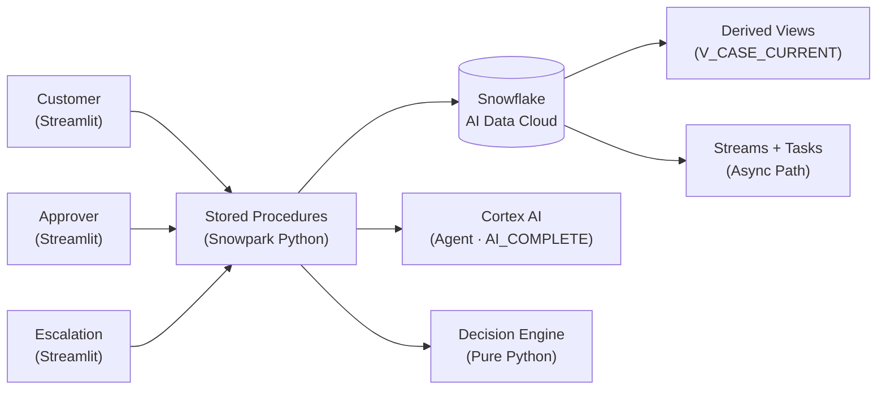
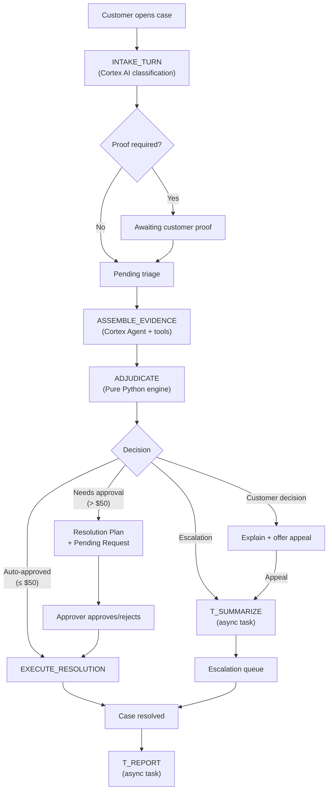

<div align="center">
  
  <h1>TIDE — Snowflake CoCo Edition</h1>
  <p><b>Triage · Investigation · Decision · Execution</b></p>
  <p>Supervised agentic dispute resolution for online retail, built natively on Snowflake.</p>

  [](#-tech-stack)
  [](#-tech-stack)
  [](#-cortex-ai-integration)
  [](#-coco-cli--build-evidence)
  [](/LICENSE)
</div>

---

## What is TIDE?

**TIDE** (Triage · Investigation · Decision · Execution) is a supervised agentic dispute-resolution platform for online retail, built natively on Snowflake. Customers report order disputes in chat; TIDE investigates against enterprise data, decides deterministically against published policy, executes low-risk resolutions autonomously, and routes exactly the cases that need judgment to humans — with the evidence already assembled and every decision auditable to a rule.

**Thesis:** dispute resolution fails in two directions — full automation hallucinates payouts; full manual review drowns agents in cases a policy table could settle. TIDE splits the work by what each side is good at: LLMs understand, investigate, and explain; a deterministic engine decides about money; humans judge the residue.

> Snowflake CoCo CLI Hackathon 2026 · Track 1: Intelligent Workflow Automation Agent

---

## ❄️ Built for Snowflake CoCo Edition

This is a **fresh project**, purpose-built for the **Snowflake CoCo CLI Hackathon 2026**. Everything — UI, logic, data, and AI — runs inside a single Snowflake account. No external services, no webhooks, no data egress.

> **Key principle:** All AI orchestration is executed natively within Snowflake via Cortex AI. No data ever leaves the Snowflake security perimeter.

### How AI is used — build-time vs runtime

- **Build-time: CoCo CLI.** This repo is CoCo-native: [`AGENTS.md`](AGENTS.md) governs agent behaviour, [`.cortex/skills/`](.cortex/skills) holds domain playbooks, and build sessions are committed as `stream-json` transcripts in `evidence/coco-transcripts/`.
- **Runtime: Snowflake Cortex.** A Cortex Agent object performs evidence assembly with genuine tool selection; fixed AI transformations use `AI_COMPLETE` with schema-constrained structured output; and **the money decision is deliberately not an LLM** — a deterministic Python engine with a test per path. That split is the design.

---

## 🌟 Core Features

### 🛍️ Customer Experience
- **Guided Intake** — Dynamically adjusting follow-up questions (≤3) replace static forms, powered by Cortex AI intent classification across 12 canonical dispute subtypes.
- **Evidence Management** — Pauses triage to collect mandatory proof images (e.g., damaged goods) before routing; a case cannot proceed until the required proof exists. *(Automated vision analysis of those images is specified but not yet implemented — see [Implementation status](#-implementation-status).)*
- **Option Branching** — Enables customers to make clear choices before the system finalizes resolution logic.
- **Structured Response Pills** — Quick-reply controls for common deterministic branches, data-grounded from the actual order record.

### 🤖 Deterministic Triage
- **Pure Python Decision Engine** — 114 tests green, 63 terminal paths, 10 guardrails. No LLM arithmetic, no hallucinated amounts. Every decision traces to a rule ID.
- **Anomaly Guardrails** — Catches duplicate refunds, unconfirmed payments, delivered-but-disputed claims, missing mandatory proof, and duplicate-charge claims unsupported by the payment record — all **before** money moves.
- **Proof-Aware Routing** — Proof-required subtypes hold the case until evidence is supplied, and the engine has terminal paths for proof that contradicts or fails to support a claim. *(Those two paths are tested but currently unreachable in the deployed system: they consume signals from the vision analysis step, which is not yet implemented.)*

### 🛡️ Human Operations & Approvals
- **Approver Dashboard** — Queue-based review: evidence, recommended decision, approve with one click or reject with enforced rigor (≥50 chars + policy citation).
- **Escalation Console** — Claim-on-open flows for human CX agents with AI-generated summaries, one-click actions, and live chat takeover.
- **Complete Audit Trail** — Every decision is an immutable event with the full input snapshot — replayable, auditable, queryable.

### 📊 Audit by Default
- Every closed case generates a complete report: intent classification, data sources queried, policies applied, decision path, approval outcome, resolution actions, and closure reason.
- Event-sourced, append-only data model — no gaps, no tampering, every case accounted for.

---

## 🏛️ Architecture

### Architecture at a Glance

```
Streamlit in Snowflake (three personas)
  → synchronous procedures for the chat path
    (intake → investigate → adjudicate → execute)
  → streams + triggered tasks for the async path
    (escalation summaries, case reports, timeout sweeping)
  → event-sourced append-only tables with derived state views
  → internal stage for proof photos (vision analysis specified, not yet built)
```

### System Diagram



### Case Resolution Flow



Full architecture details: [`docs/ARCHITECTURE.md`](docs/ARCHITECTURE.md)

---

## 🛠️ Tech Stack

| Layer | Technology |
|---|---|
| **UI** | Streamlit in Snowflake (warehouse runtime) |
| **Backend** | Snowpark Python stored procedures |
| **Decision Engine** | Pure Python module (deterministic, zero Snowflake imports) |
| **AI / ML** | Snowflake Cortex AI (Agent objects, `AI_COMPLETE`, structured output) |
| **Database** | Snowflake AI Data Cloud (5 schemas, event-sourced) |
| **Validation** | Pydantic |
| **Testing** | pytest (63 BRL path tests, runnable locally) |
| **Build Tool** | Snowflake CoCo CLI |
| **Deploy** | `python scripts/deploy.py` → idempotent SQL |

**Special Snowflake features used:** Snowpark · Streamlit in Snowflake · Cortex Agents · Cortex AI (`AI_COMPLETE`) · Cortex Search · Cortex Analyst (semantic view) · Streams & Tasks · Internal Stages

---

## 🧠 Cortex AI Integration

All AI capabilities are executed natively within Snowflake — no external endpoints.

| Component | Cortex Feature | Purpose | Status |
|---|---|---|---|
| **Investigator** | Cortex Agent (`DATA_AGENT_RUN`) | Tool-selecting evidence assembly (Analyst, Search, custom procedures) | ✅ Live |
| **Intake** | `AI_COMPLETE` (structured) | Intent classification, follow-up generation | ✅ Live |
| **Proof Analysis** | `AI_COMPLETE` (vision) | Image → damage/wrong-item/missing-item signals | ⬜ Not built |
| **Adjudication** | **Pure Python** (no AI) | Deterministic money decision — 63 paths, 10 guardrails | ✅ Live |
| **Resolution Plan** | `AI_COMPLETE` (structured) | Decision → customer-facing plan text | ⬜ Not built |
| **Escalation Summary** | `AI_COMPLETE` (structured) | Bundle + decision → human handoff summary | ✅ Live |
| **Case Report** | `AI_COMPLETE` (structured) | Full event history → audit report | ✅ Live |
| **Policy Retrieval** | Cortex Search | Policy passages for investigation + rejection citations | ✅ Live |
| **Data Queries** | Cortex Analyst (semantic view) | Natural-language queries over RETAIL schema | ✅ Live |

<a id="-implementation-status"></a>
### Implementation status

Seven of the nine AI components above are deployed and exercised on the canonical account.
Two are specified in [`docs/DETAILS.md`](docs/DETAILS.md) and deliberately not built:

- **Proof Analysis (vision).** Proof upload, storage on an internal stage, and the
  proof-required routing gate all work — a case that needs evidence will not proceed without
  it. What is missing is the automated image analysis that would populate the
  supports/contradicts signals. The engine's terminal paths for those signals exist and are
  tested; they are simply unreachable until the analysis step is written.
- **Resolution Plan.** The customer currently receives templated resolution copy assembled
  from the recorded decision rather than model-written prose. The decision itself, and every
  amount in it, is unaffected — that has never been an LLM's job here.

Both were scoped out under a published cut line rather than descoped silently. Every other
claim in this README is verifiable against the repository or a running deployment.

---

## 📂 Repository Structure

```text
TIDE-Snowflake/
├── sql/                         # Ordered, idempotent DDL (CREATE OR REPLACE)
│   ├── 00_account.sql           # Warehouses, roles, grants
│   ├── 01_triage_ddl.sql        # Cases, events, chat, views
│   ├── 02_investigation_ddl.sql # Evidence bundles, proofs, stage
│   ├── 03_decision_ddl.sql      # Constants, policies, decisions
│   ├── 04_execution_ddl.sql     # Resolution requests, reports, pipeline log
│   ├── 05_retail_ddl.sql        # Simulated enterprise data
│   └── seed/                    # Deterministic demo data
├── tide_decision/               # Pure decision engine (no Snowflake imports)
├── procedures/                  # Snowpark procedure wrappers (thin)
├── agents/                      # Cortex Agent spec (investigator.yaml)
├── streamlit/                   # Streamlit in Snowflake app
│   ├── Home.py
│   ├── pages/                   # 1_Customer, 2_Approver, 3_Escalation
│   └── ui/                      # Theme, shared components
├── tests/decision/              # pytest — one test per BRL path
├── scripts/                     # deploy.py, guard_sql.py, demo_reset.sql
├── evidence/coco-transcripts/   # Committed CoCo CLI build sessions
├── docs/
│   ├── ARCHITECTURE.md          # End-to-end system design
│   ├── BUILD_PLAN.md            # Workstreams, schedule, gates, cut lines
│   ├── DETAILS.md               # Business requirements & rules (the law)
│   └── SCHEMA.md                # Living schema reference
├── .cortex/                     # CoCo CLI skills & hooks
├── AGENTS.md                    # Development guardrails & architecture rules
├── PROVENANCE.md                # Dataset & licence declarations
├── README.md                    # ← You are here
├── SECURITY.md
├── CONTRIBUTING.md
└── LICENSE
```

---

## 🚀 Quick Start

### Prerequisites
- **Snowflake Account** with Cortex AI enabled
- **Snowflake CLI** installed
- **Python 3.11+**
- **CoCo CLI** configured

### 1. Configure Connection

```bash
# Add to ~/.snowflake/connections.toml
[tide]
account = "your_account"
user = "your_user"
password = "your_password"
```

### 2. Deploy Everything

```bash
# DDL → seed → procedures → agent → app
python scripts/deploy.py --connection tide
```

### 3. Run Decision Engine Tests

```bash
# No Snowflake account needed — pure Python
pytest tests/decision -q
```

### 4. Open the App

Navigate to the Streamlit app URL provided by the deploy script, or find it in Snowsight under **Streamlit**.

### 5. Reset Demo State (optional)

To restore the seeded demo state between rehearsals:

```bash
# Run in Snowsight or via Snowflake CLI
sqlc exec --connection tide -f scripts/demo_reset.sql
```

Pre-warm one browser session per persona 30 minutes before the demo.

---

## ❄️ CoCo CLI & Build Evidence

CoCo CLI is the **build tool** — it steers development through `AGENTS.md`, `.cortex/skills/`, and hooks. Build sessions are run with `--output-format stream-json` and committed to `evidence/coco-transcripts/` as proof of AI-assisted development.

| Directory | Purpose |
|---|---|
| `.cortex/skills/` | Domain playbooks for CoCo CLI |
| `evidence/coco-transcripts/` | Committed build session logs |
| `AGENTS.md` | Agent operating rules (build-time) |

---

## 📏 Business Rules

Core thresholds governing the deterministic decision engine (seeded in `DECISION.RULE_CONSTANTS`):

| Constant | Value | Context |
|---|---|---|
| `AUTONOMOUS_LIMIT_USD` | $50.00 | Auto-approve at or below this amount |
| `RETURN_WINDOW_DAYS` | 7 days | From delivery — disputes after this escalate |
| `DELIVERY_SLA_BREACH_DAYS` | 3 days | Past estimated delivery — triggers valid dispute |
| `INACTIVITY_TIMEOUT_MIN` | 15 min | Auto-close chat after customer inactivity |
| `MAX_FOLLOWUP_QUESTIONS` | 3 | Maximum follow-ups during intake |
| `MIN_REJECTION_CHARS` | 50 | Minimum characters for approver rejection |

**63 terminal paths** (10 guardrail + 53 routing) across 12 canonical dispute subtypes. Every path has a pytest test. For the complete rule set, see [`docs/DETAILS.md`](docs/DETAILS.md).

---

## 🤝 Contributing

See [CONTRIBUTING.md](CONTRIBUTING.md) for guidelines on how to contribute to this project.

---

## 🔒 Security

See [SECURITY.md](SECURITY.md) for our security policy and how to report vulnerabilities.

---

## Developers

<table>
  <tr>
    <td align="center">
      <a href="https://github.com/keithruezyl1">
        <br />
        <sub><b>Keith Ruezyl</b></sub>
      </a>
    </td>
    <td align="center">
      <a href="https://github.com/gabejeremy">
        <br />
        <sub><b>Gabe San Diego</b></sub>
      </a>
    </td>
    <td align="center">
      <a href="https://github.com/nicoryne/">
        <br />
        <sub><b>Nicolo Porter</b></sub>
      </a>
    </td>
  </tr>
</table>

---

## 📄 License

This project is licensed under the **Apache License 2.0** — see the [LICENSE](LICENSE) file for details.

---

<div align="center">
  <sub>Built for the <b>Snowflake CoCo CLI Hackathon 2026</b> · Powered entirely by <b>Snowflake</b></sub>
</div>
