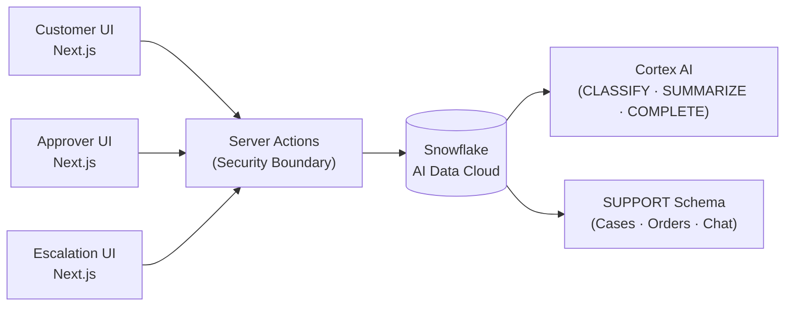
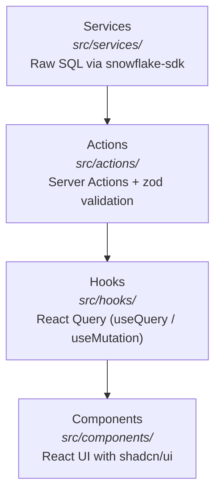
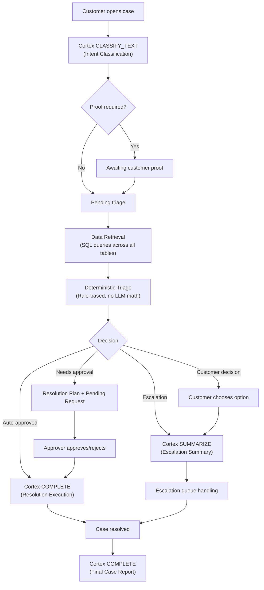

<div align="center">
  
  <h1>🦁 ROAR Engine — Snowflake CoCo Edition</h1>
  <p><b>Retail Operations and Resolution Engine</b></p>
  <p>AI-native dispute resolution, powered entirely by the Snowflake AI Data Cloud.</p>

  [](#-tech-stack)
  [](#-tech-stack)
  [](#-cortex-ai-integration)
  [](#-coco-cli-setup)
  [](/LICENSE)
</div>

---

## 📋 Table of Contents

- [What is ROAR?](#-what-is-roar)
- [What Changed — Snowflake CoCo Edition](#-what-changed--snowflake-coco-edition)
- [Core Features](#-core-features)
- [Architecture](#-architecture)
- [Tech Stack](#-tech-stack)
- [Cortex AI Integration](#-cortex-ai-integration)
- [Repository Structure](#-repository-structure)
- [Quick Start](#-quick-start)
- [CoCo CLI Setup](#-coco-cli-setup)
- [Business Rules](#-business-rules)
- [Contributing](#-contributing)
- [Security](#-security)
- [License](#-license)

---

## 🦁 What is ROAR?

**ROAR Engine** (Retail Operations and Resolution Engine) is a supervised agentic dispute-resolution platform tailored for online retail support. It bridges the gap between chaotic customer support chats and enterprise backend systems — Order Management, Payment Gateways, Logistics, and Inventory.

By leveraging a deterministic triage engine and six specialized AI agent workflows, ROAR automates:
- **Case intake** — structured, conversational, evidence-aware
- **Context retrieval** — data from every relevant system in one pass
- **Decision-making** — rule-based, auditable, never probabilistic where it matters
- **Resolution execution** — drafted plans, human-approved, then executed
- **Escalation** — full AI-generated context handoff to human agents
- **Audit reporting** — complete case documentation, automatically

ROAR is not a chatbot. It is not a ticketing system. It is an **agentic operations layer** that makes human agents faster, more informed, and more consistent — and eliminates the need for human involvement entirely on the cases that don't require it.

---

## ❄️ What Changed — Snowflake CoCo Edition

This edition is a **complete re-architecture** of the [original ROAR Engine](https://github.com/keithruezyl1/ROAR), purpose-built for the **Snowflake CoCo CLI Hackathon 2026**.

| Original Stack           | Snowflake CoCo Edition                 |
|--------------------------|----------------------------------------|
| PostgreSQL               | **Snowflake AI Data Cloud**            |
| FastAPI (Python)         | **Next.js Server Actions**             |
| n8n + OpenAI (GPT-4o)   | **Snowflake Cortex AI (native SQL)**   |
| SQLAlchemy / Drizzle ORM | **`snowflake-sdk` (raw SQL)**          |
| Docker containers        | **CoCo CLI orchestration**             |
| Railway / Vercel deploy  | **Snowflake-native deployment**        |

> **Key principle:** All AI orchestration that previously ran through n8n workflows and external OpenAI API calls is now executed natively within Snowflake via Cortex AI SQL functions. No data ever leaves the Snowflake security perimeter.

---

## 🌟 Core Features

### 🛍️ Customer Experience
- **Guided Intake** — Dynamically adjusting follow-up questions replace static forms, powered by Cortex AI intent classification.
- **Evidence Management** — Dynamically pauses triage to collect mandatory proof images (e.g., damaged goods) before routing.
- **Option Branching** — Enables customers to make clear choices before the system finalizes resolution logic.
- **Structured Response Pills** — Quick-reply controls for common deterministic branches.

### 🤖 Deterministic Triage
- **Threshold-based Logic** — Automatic approval workflows driven by hardcoded thresholds and rules — no LLM arithmetic, no hallucinations.
- **Proof-Aware Context** — Detects contradictions or insufficiencies in uploaded order evidence.
- **Validation Guardrails** — Verifies payment confirmations, delivery SLA breaches, and inventory constraints before drafting resolutions.

### 🛡️ Human Operations & Approvals
- **Approver Dashboard** — Specialized cards and action panels to approve, reject, or modify refund/return/replacement requests.
- **Escalation Queue** — Claim-and-handle flows for human CX agents, injected exactly when AI fails or data inconsistencies arise.
- **AI-Generated Summaries** — Instant context handoffs via `CORTEX.SUMMARIZE()`, outlining exactly why a case escalated and what rules passed/failed.

### 📊 Audit by Default
- Every conversation that closes generates a complete case report — intent classification, data sources queried, policies applied, triage decision, approval outcome, resolution actions, and closure reason.
- No manual documentation. No gaps. Every case is accounted for.

---

## 🏛️ Architecture

### System Overview



### 4-Tier Data Flow Pipeline



> Data flows in **one direction only**: Services → Actions → Hooks → Components.

### Case Resolution Flow



---

## 🛠️ Tech Stack

| Layer            | Technology                                                 |
|------------------|------------------------------------------------------------|
| **Frontend**     | Next.js 14+ (App Router), React 18, TypeScript             |
| **Styling**      | Tailwind CSS, shadcn/ui, Lucide Icons                       |
| **Backend**      | Next.js Server Actions (`"use server"`)                     |
| **Database**     | Snowflake AI Data Cloud (`snowflake-sdk` for Node.js)       |
| **AI / ML**      | Snowflake Cortex AI (CLASSIFY, SUMMARIZE, COMPLETE, EXTRACT)|
| **State**        | @tanstack/react-query                                       |
| **Validation**   | zod                                                         |
| **Orchestration**| Snowflake CoCo CLI                                          |

---

## 🧠 Cortex AI Integration

All AI capabilities are executed natively within Snowflake — no external LLM API calls.

| Agent Function              | Cortex AI SQL Function                              | Purpose                                             |
|-----------------------------|------------------------------------------------------|------------------------------------------------------|
| Intake & Classification     | `SNOWFLAKE.CORTEX.CLASSIFY_TEXT()` / `EXTRACT_ANSWER()` | Determine dispute intent (Refund, Replacement, Status) |
| Data Retrieval              | Standard `SELECT` queries                            | Compile information bundle from all source tables     |
| Deterministic Triage        | Pure SQL logic (no LLM)                              | Threshold checks, rule-based routing                  |
| Escalation Summary          | `SNOWFLAKE.CORTEX.SUMMARIZE(transcript)`             | Generate structured context for human agents          |
| Resolution Drafting         | `SNOWFLAKE.CORTEX.COMPLETE('model', prompt)`         | Draft response templates from enterprise context      |
| Case Report Generation      | `SNOWFLAKE.CORTEX.COMPLETE('model', prompt)`         | Full audit report on conversation close               |

---

## 📂 Repository Structure

```text
ROAR-Snowflake/
├── src/
│   ├── app/                  # Next.js App Router (pages, layouts, metadata)
│   │   ├── metadata.ts       # Head metadata exports
│   │   ├── font.ts           # Font configuration
│   │   ├── (customer)/       # Customer-facing routes
│   │   ├── (approver)/       # Approver dashboard routes
│   │   └── (escalation)/     # Escalation agent routes
│   ├── services/             # Snowflake SQL query functions
│   ├── actions/              # Next.js Server Actions (security boundary)
│   ├── hooks/                # React Query hooks
│   ├── components/           # React UI (shadcn/ui)
│   │   └── ui/               # shadcn/ui primitives
│   ├── lib/                  # Shared utilities (snowflake-client.ts)
│   └── types/                # TypeScript interfaces
├── snowflake/                # CoCo CLI: DDL, DML, stored procedures
│   ├── *.sql                 # Snowflake setup scripts
│   └── init.sh               # Bootstrap script
├── ROAR-old/                 # Archived original repository (reference only)
├── AGENTS.md                 # Development guardrails & architecture rules
├── README.md                 # ← You are here
├── SECURITY.md               # Security policy
├── CONTRIBUTING.md           # Contribution guidelines
├── LICENSE                   # Apache 2.0
└── .env.example              # Required environment variables
```

---

## 🚀 Quick Start

### Prerequisites

- **Node.js** LTS (20+) & npm
- **Snowflake Account** with Cortex AI enabled
- **Snowflake CoCo CLI** installed and configured

### 1. Clone & Install

```bash
git clone https://github.com/your-org/ROAR-Snowflake.git
cd ROAR-Snowflake
npm install
```

### 2. Configure Environment

```bash
cp .env.example .env.local
# Edit .env.local with your Snowflake credentials
```

### 3. Provision Snowflake

```bash
cd snowflake
chmod +x init.sh
./init.sh
```

This runs all SQL scripts via the CoCo CLI to create the `ROAR_DB` database, `SUPPORT` schema, tables, roles, and seed data.

### 4. Run the Dev Server

```bash
npm run dev
```

Open [http://localhost:3000](http://localhost:3000) to see ROAR Engine.

---

## ❄️ CoCo CLI Setup

The `snowflake/` directory contains all terminal-first orchestration scripts:

| File                   | Purpose                                                  |
|------------------------|----------------------------------------------------------|
| `init.sh`              | Master bootstrap — runs all SQL scripts in order          |
| `001-database.sql`     | Create `ROAR_DB` and `SUPPORT` schema                    |
| `002-tables.sql`       | Table definitions (cases, orders, chat, inventory, etc.)  |
| `003-roles.sql`        | `ROAR_APP_ROLE` with least-privilege grants               |
| `004-procedures.sql`   | Cortex AI–powered stored procedures                       |
| `005-seed.sql`         | Demo data for development and testing                     |

> The CoCo CLI scripts are designed to be lightweight and readable in a terminal buffer — no heavy GUI dependencies.

---

## 📏 Business Rules

Core thresholds governing the triage engine:

| Constant                     | Value      | Context                                         |
|------------------------------|------------|-------------------------------------------------|
| `REFUND_AUTO_THRESHOLD`      | ฿500       | Auto-approve refunds at or below this amount    |
| `RETURN_WINDOW_DAYS`         | 7 days     | From delivery date — disputes after this escalate |
| `DELIVERY_SLA_BREACH_DAYS`   | 3 days     | Past estimated delivery — triggers valid dispute |
| `INACTIVITY_TIMEOUT_MINUTES` | 15 min     | Auto-close chat after customer inactivity        |
| `MAX_INTAKE_QUESTIONS`       | 3          | Maximum follow-up questions during intake        |
| `MIN_REJECTION_REASON_CHARS` | 50         | Minimum characters for approver rejection reason |

For the complete triage rule set and 34 resolution scenarios, see the [documentation](./ROAR-old/docs/).

---

## 🤝 Contributing

See [CONTRIBUTING.md](CONTRIBUTING.md) for guidelines on how to contribute to this project.

---

## 🔒 Security

See [SECURITY.md](SECURITY.md) for our security policy and how to report vulnerabilities.

---

## 📄 License

This project is licensed under the **Apache License 2.0** — see the [LICENSE](LICENSE) file for details.

---

<div align="center">
  <sub>Built for the <b>Snowflake CoCo CLI Hackathon 2026</b> · Powered by <b>Snowflake Cortex AI</b></sub>
</div>
